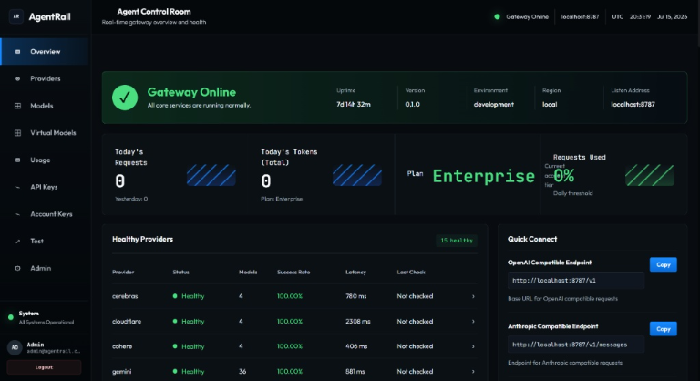

<h1 align="center">AgentRail</h1>

<p align="center">
  <strong>一个面向 Claude Code、Codex、Cline、Continue 等 AI 工具的本地统一网关，由你自己的 Provider Key 驱动。</strong>
</p>

<p align="center">
  自备 Key，保留本地，统一暴露一个稳定的 OpenAI / Anthropic 兼容入口：<code>http://localhost:42424</code>。
</p>

<p align="center">
  <strong>Star us&nbsp;→</strong>
  <a href="https://github.com/vzubcu/AgentRail" title="Star AgentRail on GitHub">
    
  </a>
  &nbsp;·&nbsp;
  <a href="#quick-start" title="跳转到 Quick Start">
    
  </a>
  &nbsp;·&nbsp;
  <a href="./docs/agents/" title="阅读 AgentRail Agent 配置指南">
    
  </a>
  &nbsp;·&nbsp;
  <a href="https://vzubcu.github.io/AgentRail/" title="打开 AgentRail 项目页面">
    
  </a>
  &nbsp;·&nbsp;
  <a href="./LICENSE" title="AgentRail 使用 MIT 许可证">
    
  </a>
</p>

<p align="center">
  
</p>

<p align="center">
  <a href="./README.md">English</a>
  ·
  <a href="./CONTRIBUTING.md">Contributing</a>
  ·
  <a href="./contribution.md">中文贡献指南</a>
</p>

## 为什么值得 Star

- **一个本地入口接入 AI 工具**，统一处理 OpenAI / Anthropic 兼容工作流。
- **BYOK，本地优先**，不托管代理，不共享 Key 池。
- **回退路由**，某个 Provider 或路由不可用时可自动切换。
- **兼容主流编程工具**，包括 Claude Code、Codex、Continue、Cline、Roo Code、Kilo Code、OpenCode。
- **自带真实控制台**，可管理 Provider Key、模型目录、健康状态和测试请求。
- **面向快速变化的免费额度生态**，但不会误导你以为 AgentRail 自己提供免费 API。

> AgentRail 不提供免费 API 访问。它把你已经拥有的 Provider Key 统一到一个本地 API 面上。

## Quick Start

### 1. 今天就能用的源码安装方式

```bash
git clone https://github.com/vzubcu/AgentRail.git
cd AgentRail
npm install
npm run build
npm start
```

### 2. 打开控制台

- `http://localhost:42424/`

### 3. 添加 Provider Key

在 **Providers** 页面配置一个或多个 Provider Key。对于同一个 Provider，AgentRail 可以轮换多把 key 进行请求。

### 4. 把工具指向 AgentRail

- OpenAI 兼容客户端：`http://localhost:42424/v1`
- Anthropic 兼容客户端：`http://localhost:42424`

详细接入说明请看 [`docs/agents/`](./docs/agents/)。

## 支持哪些工具

AgentRail 适合所有能直接请求本机自定义 OpenAI / Anthropic 兼容 endpoint 的工具：

- Claude Code
- Codex CLI / Codex Desktop
- Continue
- Cline
- Roo Code
- Kilo Code
- OpenCode
- Aider 以及其他本机可直连的兼容客户端

## 为什么它有意义

免费模型生态变化很快：Provider、额度、兼容性和可用路由会持续变化。AgentRail 给本地工具提供一个稳定 base URL，同时把 Key 留在本机，并把 Provider 侧的波动吸收到网关层。

## AgentRail 提供什么

- **协议归一化**：同时兼容 OpenAI 和 Anthropic 风格请求。
- **回退路由**：当某条路由失败时，自动尝试其他可用路由。
- **模型发现**：聚合支持的 Provider，提供统一的可聊天模型目录。
- **运行时 Key 管理**：通过 dashboard 或 REST API 配置密钥，无需重启。
- **健康检查与记忆状态**：重启后更容易恢复 Provider 状态与 active model 可见性。
- **Quick Connect**：为常见 coding tools 生成更安全的接入配置，而不把 gateway secret 写死到磁盘。
- **Virtual Models**：支持 preview、dry-run、clone、templates、trace、sticky routing、weighted pool 与 cooldown 感知裁剪。

## 开发模式

### Mode A: Full Docker（推荐）

```bash
git clone https://github.com/vzubcu/AgentRail.git
cd AgentRail
docker compose up -d
```

### Mode B: Hybrid（Postgres 在 Docker，应用跑本机）

```bash
git clone https://github.com/vzubcu/AgentRail.git
cd AgentRail
docker compose -f docker-compose.db.yml up -d
set AGENTRAIL_SECRETS_DATABASE_URL=<your_postgres_connection_string>
set AGENTRAIL_SECRET_ENCRYPTION_KEY=<your_local_encryption_key>
set AGENTRAIL_SAAS=1
npm install
npm run build
npm start
```

### Mode C: 完全本地（无 Docker，无 Postgres）

```bash
git clone https://github.com/vzubcu/AgentRail.git
cd AgentRail
npm install
set AGENTRAIL_SAAS=1
npm run build
npm start
```

> 如果未配置 Postgres，本地状态会落在 `.agentrail/*.json`。

## 已支持 Provider

当前在 `src/providers/index.ts` 中接入：

`openrouter`、`groq`、`github`、`reka`、`google`、`cloudflare`、`siliconflow`、`cerebras`、`mistral`、`nous-research`、`openadapter`、`tokenrouter`、`bluesminds`、`cohere`、`nvidia`、`llm7`、`kilo`、`zhipu`、`opencode`、`zenmux`

## 当前能力

### 兼容层

- OpenAI 兼容 chat completions
- OpenAI 兼容 legacy completions（`/v1/completions`）
- OpenAI Responses API 兼容子集，适用于 Codex Desktop 等工具
- 本地 OpenAI 风格文件接口（`/v1/files`）
- OpenAI 风格模型列表（仅聊天能力路由）
- Active model capability catalog
- Anthropic Messages API 桥接
- 稳定的非流式 usage 归一化
- 保守的 Anthropic streaming 行为，不再伪造 0 usage 占位

### 网关运维能力

- Provider 健康检查与状态汇总
- 模型目录刷新与缓存回退
- 本地运行时密钥管理
- 可选网关鉴权：`AGENTRAIL_API_KEY`
- 能力范围化的 SaaS API keys
- 可选统一出站代理：`HTTP_PROXY`

### 本地控制台

- 浏览 Providers 与模型
- 查看 Provider 健康状态与延迟
- 配置 Provider Keys
- 刷新模型目录
- 管理 virtual models、preview、trace 与 test console

## 配置你的 Agent

AgentRail 同时暴露 OpenAI-compatible 和 Anthropic-compatible 本地 endpoint。详细接入文档在 [`docs/agents/`](./docs/agents/)。

- [OpenRouter Provider Setup](./docs/providers/openrouter.md)
- [Local endpoint and remote proxy limitations](./docs/agents/local-endpoints-and-remote-proxies.md)
- [Claude Code setup guide](./docs/agents/claude-code.md)
- [Codex CLI setup guide](./docs/agents/codex-cli.md)
- [OpenCode setup guide](./docs/agents/opencode.md)
- [Continue setup guide](./docs/agents/continue.md)
- [Cline setup guide](./docs/agents/cline.md)
- [Roo Code setup guide](./docs/agents/roo-code.md)
- [Kilo Code setup guide](./docs/agents/kilo-code.md)
- [Codex Desktop setup guide](./docs/agents/codex-desktop.md)
- [Aider integration guide](./docs/agents/aider.md)
- [Rider / Junie guide](./docs/agents/rider-junie.md)

### Claude Code

```bash
export ANTHROPIC_BASE_URL=http://localhost:42424
export ANTHROPIC_API_KEY=<your AGENTRAIL_API_KEY or any non-empty string>
```

### Codex CLI

```powershell
$env:AGENTRAIL_API_KEY="your_agentrail_api_key"
codex --profile agentrail-auto
```

### OpenAI-compatible 工具

- Base URL: `http://localhost:42424/v1`
- API key: `AGENTRAIL_API_KEY`，或在关闭 gateway auth 时使用任意非空值

### Anthropic-compatible 工具

- Base URL: `http://localhost:42424`
- API key: `AGENTRAIL_API_KEY`，或在关闭 gateway auth 时使用任意非空值

## 本地安全模型

AgentRail 默认绑定 `127.0.0.1`。只有在你明确需要局域网访问时，才应设置 `HOST=0.0.0.0`。

浏览器 CORS 默认只允许本机 localhost 来源。若配置了 `AGENTRAIL_API_KEY`，管理接口和 `/v1/*` API 都必须带上 `Authorization: Bearer <AGENTRAIL_API_KEY>` 或 `x-api-key: <AGENTRAIL_API_KEY>`。

在 SaaS 模式下，浏览器 session 使用 `HttpOnly` cookie、`SameSite=Strict`、服务端 session 记录、CSRF 保护与登录节流。SaaS API key 只保存 hash，明文只在创建时显示一次。

## 常用环境变量

| 变量名 | 作用 |
|---|---|
| `AGENTRAIL_API_KEY` | 可选，调用 AgentRail 时的网关鉴权密钥 |
| `AGENTRAIL_PROVIDER_TIMEOUT_MS` | 可选，出站 Provider 请求超时时间，单位毫秒（默认：`30000`） |
| `AGENTRAIL_SECRETS_DATABASE_URL` | Postgres 连接串，用于加密托管密钥 |
| `AGENTRAIL_SECRET_ENCRYPTION_KEY` | Provider 凭据静态加密密钥来源 |
| `AGENTRAIL_FILES_ROOT` | 本地文件存储根目录覆盖项（默认 `.agentrail/files`） |
| `OPENROUTER_API_KEY` | OpenRouter 密钥 |
| `GROQ_API_KEY` | Groq 密钥 |
| `GITHUB_TOKEN` | GitHub Models token |
| `REKA_API_KEY` | Reka API key |
| `GEMINI_API_KEY` | Google AI Studio Gemini API key |
| `CLOUDFLARE_API_KEY` | Cloudflare API key |
| `CLOUDFLARE_ACCOUNT_ID` | Cloudflare 模型同步所需账号 ID |
| `SILICONFLOW_API_KEY` | SiliconFlow key |
| `CEREBRAS_API_KEY` | Cerebras key |
| `MISTRAL_API_KEY` | Mistral key |
| `NOUS_RESEARCH_API_KEY` | Nous Research key |
| `OPENADAPTER_API_KEY` | OpenAdapter key |
| `TOKENROUTER_API_KEY` | TokenRouter key |
| `BLUESMINDS_API_KEY` | BluesMinds key |
| `COHERE_API_KEY` | Cohere key |
| `NVIDIA_API_KEY` | NVIDIA NIM key |
| `LLM7_API_KEY` | LLM7 key |
| `KILO_API_KEY` | Kilo key |
| `ZHIPU_API_KEY` | 智谱 / BigModel key |
| `OPENCODE_API_KEY` | OpenCode key |
| `HTTP_PROXY` | 可选，统一出站 HTTP 代理 |

## API 示例

### OpenAI-compatible chat completion

```bash
curl http://localhost:42424/v1/chat/completions \
  -H "Content-Type: application/json" \
  -H "Authorization: Bearer $AGENTRAIL_API_KEY" \
  -d '{
    "model": "llama-3.3-70b",
    "messages": [{"role": "user", "content": "介绍一下 AgentRail"}],
    "stream": false
  }'
```

### OpenAI Responses-compatible request

```bash
curl http://localhost:42424/v1/responses \
  -H "Content-Type: application/json" \
  -H "Authorization: Bearer $AGENTRAIL_API_KEY" \
  -d '{
    "model": "llama-3.3-70b",
    "input": "介绍一下 AgentRail"
  }'
```

### Anthropic-compatible messages request

```bash
curl http://localhost:42424/v1/messages \
  -H "Content-Type: application/json" \
  -H "Authorization: Bearer $AGENTRAIL_API_KEY" \
  -d '{
    "model": "llama-3.3-70b",
    "max_tokens": 256,
    "messages": [{"role": "user", "content": "你好"}]
  }'
```

## HTTP 接口清单

| 方法 | 路径 | 说明 |
|---|---|---|
| `GET` | `/` | Web 控制台 |
| `GET` | `/health` | 服务健康检查 |
| `GET` | `/api/catalog` | Provider / Model / Health 汇总 |
| `GET` | `/api/models/active` | Active models with capability metadata |
| `POST` | `/api/health/check/:provider` | 单 Provider 健康检测 |
| `POST` | `/api/health/check-all` | 同步执行全量 Provider 健康检测 |
| `POST` | `/api/health/check-all?async=1` | 后台启动全量 Provider 健康检测 |
| `GET` | `/api/health/check-all/status` | 读取全量 Provider 健康检测任务状态 |
| `POST` | `/api/models/refresh` | 刷新模型列表 |
| `POST` | `/api/models/refresh/:provider` | 刷新单个 Provider 模型列表 |
| `POST` | `/api/config/keys` | 保存运行时 / 持久化密钥 |
| `GET` | `/api/config/keys/summary` | 返回脱敏后的 Provider key 概览 |
| `POST` | `/v1/chat/completions` | OpenAI 兼容对话接口 |
| `POST` | `/v1/completions` | Legacy OpenAI completions |
| `GET` | `/v1/models` | OpenAI 兼容模型列表 |
| `POST` | `/v1/responses` | OpenAI Responses-compatible 子集 |
| `POST` | `/v1/messages` | Anthropic-compatible messages |
| `POST` | `/v1/files` | 上传本地文件记录 |
| `GET` | `/v1/files` | 列出本地文件记录 |

## 目录结构

```text
src/
  index.ts                # 启动入口
  server.ts               # 薄封装入口，导出 HTTP server
  http/                   # Request context、auth、route modules 与 server composition
  router.ts               # Provider 路由与失败重试
  providers/              # Provider 定义与模型同步编排
  models/                 # 模型注册、同步与缓存
  web/                    # 控制台前端
  config*.ts              # 运行时与持久化配置
  health.ts               # 健康检查与聚合
  anthropic-bridge.ts     # Anthropic 与 OpenAI 协议转换
  responses-bridge.ts     # Responses API 与内部 chat 兼容桥接
  usage.ts                # usage 归一化辅助模块
```

## 开发命令

```bash
npm run dev
npm run web:build
npm run migrate:latest
npm run build
npm start
npm run test:virtual-models-ui
npm run test:virtual-models
npm run test:usage
```

## Maintainer Notes

- Backend HTTP composition guide: [docs/HTTP_ROUTING.md](./docs/HTTP_ROUTING.md)
- Frontend dashboard structure: [docs/FRONTEND_DASHBOARD.md](./docs/FRONTEND_DASHBOARD.md)

## 贡献

- English: [CONTRIBUTING.md](./CONTRIBUTING.md)
- 中文: [contribution.md](./contribution.md)

## License

MIT
