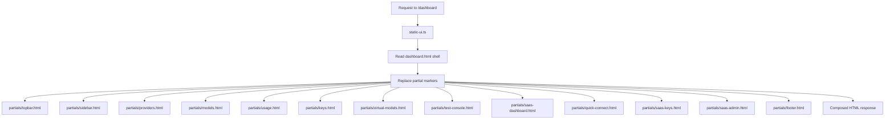

# Dashboard HTML Refactoring Plan

## Current State
- `dashboard.html` = 1113 lines, 10 tab sections
- Server (`static-ui.ts`) reads file directly and serves it (no template processing)
- JS app (`router.js`, `dashboard-app.js`) queries DOM by `.tab-content` and `getElementById` for dynamic content
- 5 regression scripts depend on the monolithic file (check for specific ids like `data-tab="quick-connect"`, `id="quick-connect"`, `/CLI/i`)

## Chosen Approach: Runtime Composition
The server inlines partials on each request. `dashboard.html` becomes a thin shell with `<!-- partial:name -->` markers. `static-ui.ts` reads the shell, replaces markers with partial contents, and serves the composed HTML.

### Benefits
- Partials are the single source of truth (no build step change needed)
- No duplication of assembled output
- Regression tests still pass (composed output is byte-identical to current)

## Proposed Split

### Tab Sections → `partials/`
| Section | Lines | File |
|---------|-------|------|
| Providers | 148-188 | `partials/providers.html` |
| Models | 190-220 | `partials/models.html` |
| Usage | 222-297 | `partials/usage.html` |
| API Keys | 299-336 | `partials/keys.html` |
| Virtual Models | 361-378 | `partials/virtual-models.html` |
| Test Console | 380-450 | `partials/test-console.html` |
| SaaS Dashboard | 452-581 | `partials/saas-dashboard.html` |
| Quick Connect | 582-940 | `partials/quick-connect.html` |
| SaaS Keys | 941-984 | `partials/saas-keys.html` |
| SaaS Admin | 986-1096 | `partials/saas-admin.html` |

### Shared Components → `partials/`
- Top bar (lines 12-31) → `partials/topbar.html`
- Sidebar nav (lines 34-144) → `partials/sidebar.html`
- Footer (lines 1100-1102) → `partials/footer.html`

### Shell → `dashboard.html` (thin)
```html
<!DOCTYPE html>
<html lang="en">
<head>...</head>
<body class="dashboard-page">
  <div class="app-shell">
    <div class="dashboard-shell" id="dashboard-shell">
      <!-- partial:topbar -->
      <main class="console-layout">
        <!-- partial:sidebar -->
        <!-- partial:providers -->
        <!-- partial:models -->
        <!-- partial:usage -->
        <!-- partial:keys -->
        <!-- partial:virtual-models -->
        <!-- partial:test-console -->
        <!-- partial:saas-dashboard -->
        <!-- partial:quick-connect -->
        <!-- partial:saas-keys -->
        <!-- partial:saas-admin -->
      </main>
      <!-- partial:footer -->
    </div>
  </div>
  <link rel="stylesheet" href="/static/dist/app.css">
  <script type="module" src="/static/dist/app.js"></script>
</body>
</html>
```

## Implementation Steps
1. Create `partials/` directory
2. Extract each section to its own file (preserving exact HTML)
3. Rewrite `dashboard.html` as thin shell with `<!-- partial:name -->` markers
4. Update `static-ui.ts` to compose partials at runtime (read shell, replace markers)
5. Add a small `composeDashboardHtml()` helper in `static-ui.ts` (or a new `template.ts` module)
6. Run regression tests (`test:frontend-dom`, `test:frontend-saas`, `test:frontend-quick-connect`, `test:agent-config`, `test:frontend-style-entry`) to verify composed output matches

## Architecture Diagram


